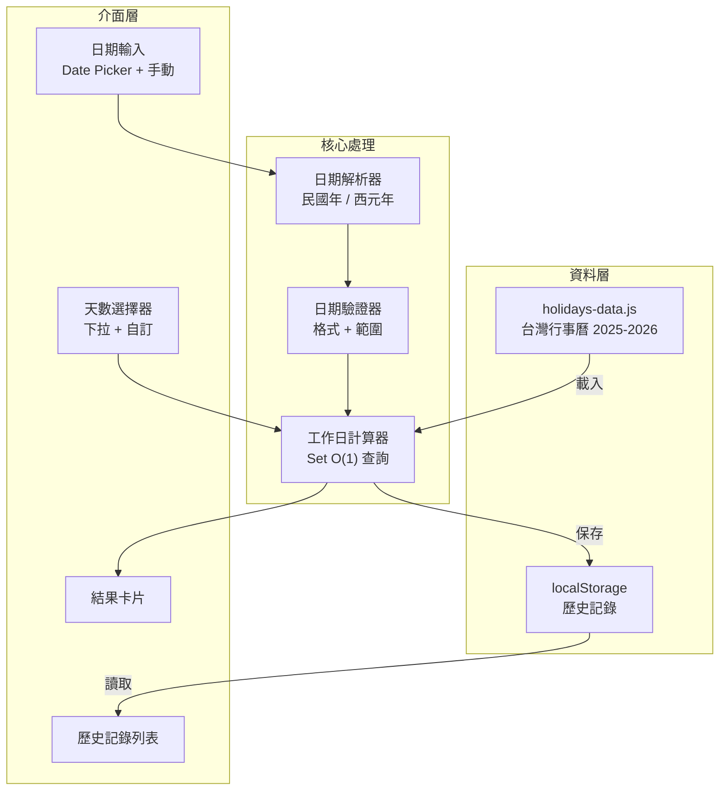
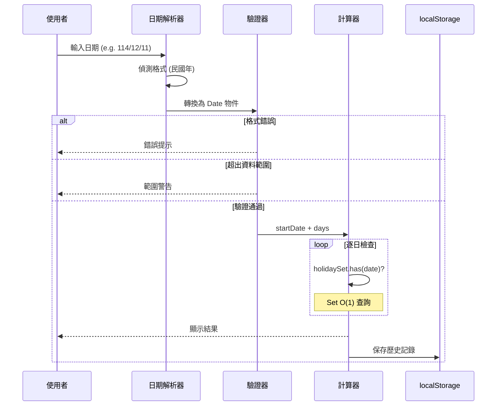

# Workday Calculator

[](https://opensource.org/licenses/MIT)
[](https://tznthou.github.io/day-12-workday/)
[](https://tailwindcss.com/)
[](https://fontawesome.com/)

> 計算從指定日期起的第 N 個工作日，自動排除台灣國定假日與週末

[← 回到 Muripo HQ](https://tznthou.github.io/muripo-hq/)

---

## TL;DR

輸入日期（支援民國年），選擇天數，一鍵算出第 N 個工作日。自動排除假日與週末，還能處理「補班日」這種週六上班的特殊情況。歷史記錄自動保存，方便重複查詢。

---

## 系統架構



---

## 計算流程



---

## Quick Start

```bash
# 直接用瀏覽器開啟
open index.html

# 或使用任何 HTTP 伺服器
npx live-server
```

---

## 功能特色

| 功能 | 說明 |
|------|------|
| **多種日期格式** | 114/12/11、1141211、2025/12/11、20251211 |
| **自訂天數** | 5 / 7 / 9 / 10 / 14 / 21 / 30 天，或自訂 1-365 天 |
| **快速日期按鈕** | 今天、昨天、下週一、清空 |
| **歷史記錄** | 自動保存最近 10 筆，支援重用與刪除 |
| **補班日處理** | 正確識別週六補班日為工作日 |
| **自然主義 UI** | 有機圓角、柔和配色、漸層背景 |

---

## 技術棧

| 技術 | 用途 |
|------|------|
| HTML5 | 頁面結構 |
| Tailwind CSS (CDN) | 樣式與響應式佈局 |
| Vanilla JavaScript (ES6+) | 業務邏輯 |
| Font Awesome 6.4.0 | 圖示 |
| localStorage API | 歷史記錄持久化 |
| Set 資料結構 | O(1) 假日查詢 |

---

## 專案結構

```
day-12-workday/
├── index.html        # 頁面結構 + Tailwind 設定
├── script.js         # 業務邏輯（日期計算、歷史記錄）
├── holidays-data.js  # 假日資料（2025-2026 台灣行事曆）
└── README.md         # 專案說明
```

---

## 核心機制

### 假日資料處理

```javascript
// holidays-data.js 結構
{ date: "20250101", isHoliday: true, description: "中華民國開國紀念日" }
{ date: "20250208", isHoliday: false, description: "補行上班" }  // 週六補班
```

載入時過濾出 `isHoliday: true` 的日期，存入 `Set` 資料結構：

| 方法 | 時間複雜度 | 說明 |
|------|-----------|------|
| `Array.includes()` | O(n) | 每次查詢遍歷整個陣列 |
| `Set.has()` | O(1) | 雜湊表查詢，即使資料量增加也維持常數時間 |


### 日期格式解析

| 輸入格式 | 範例 | 解析方式 |
|----------|------|----------|
| 民國年/月/日 | 114/12/11 | 拆分後 +1911 轉西元 |
| 民國年月日 | 1141211 | 前 3 碼年份 +1911 |
| 西元年/月/日 | 2025/12/11 | 直接解析 |
| 西元年月日 | 20251211 | 前 4 碼年份 |

---

## 資料來源與授權

假日資料來自 [ruyut/TaiwanCalendar](https://github.com/ruyut/TaiwanCalendar)，原始資料依據[政府資料開放授權條款第1版](https://data.gov.tw/license)，重製資料採用 [CC BY 4.0](https://creativecommons.org/licenses/by/4.0/deed.zh-hant) 授權。

---

## 維護計畫

### 年度假日更新

本專案需要**每年定期更新假日資料**以確保計算正確：

| 年份 | 資料狀態 | 更新時機 |
|------|----------|----------|
| 2025 | ✅ 已收錄 | - |
| 2026 | ✅ 已收錄 | - |
| 2027 | ⏳ 待更新 | 2026 年 6-8 月 |
| 2028 | ⏳ 待更新 | 2027 年 6-8 月 |
| ... | ⏳ 待更新 | 每年 6-8 月 |

### 更新流程

1. **監控來源**：台灣人事行政總處每年 6-8 月公布隔年行事曆
2. **取得資料**：從 [ruyut/TaiwanCalendar](https://github.com/ruyut/TaiwanCalendar) 取得更新後的 JSON
3. **轉換格式**：將 JSON 轉為 `holidays-data.js` 格式
4. **驗證測試**：確認補班日、連假等特殊情況正確標記
5. **部署更新**：推送至 GitHub Pages

### 注意事項

- 若超出資料範圍，計算器會顯示警告訊息
- 建議設定年度提醒，避免遺漏更新

---

## 隨想

### 從「第九日」到「第 N 日」

這個工具最初只有一個功能：算第九個工作日。因為工作上常常遇到「九個工作日內回覆」的需求，乾脆做個小工具。

後來發現不只我需要，其他人也有類似需求，但天數不一定是九天。於是加入了自訂天數功能，從「9day 計算器」變成「工作日計算器」。


### 自然主義風格

UI 的靈感來自「不那麼數位」的設計趨勢：有機形狀、柔和配色、不對稱的圓角。希望讓計算工具看起來不那麼冰冷。

---

## 授權

[](https://opensource.org/licenses/MIT)

本專案採用 [MIT License](LICENSE) 授權。
