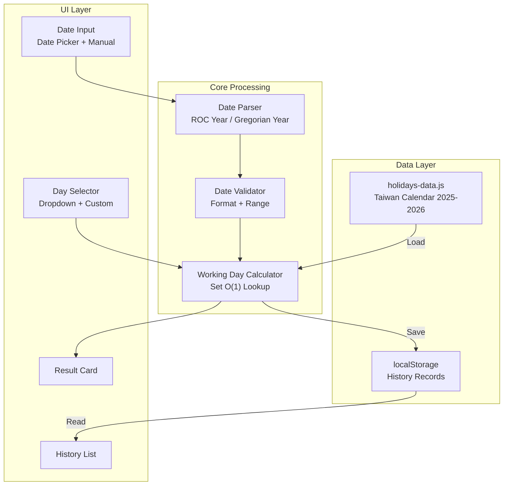
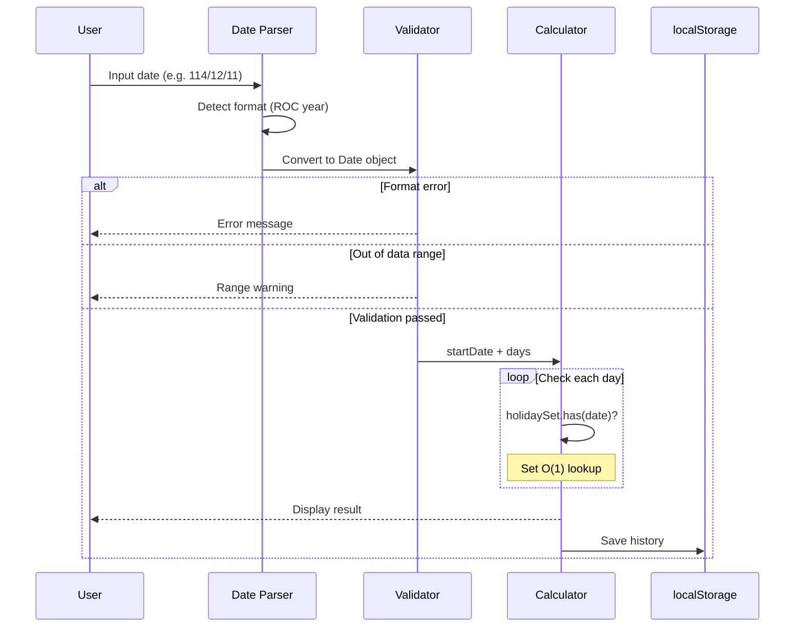

# Workday - Calculate the Nth Working Day Excluding Taiwan Holidays

[](https://opensource.org/licenses/MIT)
[](https://tznthou.github.io/day-12-workday/)
[](https://tailwindcss.com/)
[](https://fontawesome.com/)

> Calculate the Nth working day from a specified date, automatically excluding Taiwan national holidays and weekends

[← Back to Muripo HQ](https://tznthou.github.io/muripo-hq/) | [中文](README.md)

---

## TL;DR

Enter a date (supports ROC calendar year), select the number of days, and calculate the Nth working day with one click. Automatically excludes holidays and weekends, and handles "make-up work days" - those special Saturdays when offices are open. History is automatically saved for convenient repeated queries.

---

## System Architecture



---

## Calculation Flow



---

## Quick Start

```bash
# Open directly in browser
open index.html

# Or use any HTTP server
npx live-server
```

---

## Features

| Feature | Description |
|---------|-------------|
| **Multiple Date Formats** | 114/12/11, 1141211, 2025/12/11, 20251211 |
| **Custom Days** | 5 / 7 / 9 / 10 / 14 / 21 / 30 days, or custom 1-365 days |
| **Quick Date Buttons** | Today, Yesterday, Next Monday, Clear |
| **History Records** | Auto-saves last 10 entries, supports reuse and delete |
| **Make-up Day Handling** | Correctly identifies Saturday make-up days as working days |
| **Naturalistic UI** | Organic rounded corners, soft colors, gradient background |

---

## Tech Stack

| Technology | Purpose |
|------------|---------|
| HTML5 | Page structure |
| Tailwind CSS (CDN) | Styling & responsive layout |
| Vanilla JavaScript (ES6+) | Business logic |
| Font Awesome 6.4.0 | Icons |
| localStorage API | History persistence |
| Set data structure | O(1) holiday lookup |

---

## Project Structure

```
day-12-workday/
├── index.html        # Page structure + Tailwind config
├── script.js         # Business logic (date calculation, history)
├── holidays-data.js  # Holiday data (2025-2026 Taiwan calendar)
└── README.md         # Project documentation
```

---

## Core Mechanisms

### Holiday Data Processing

```javascript
// holidays-data.js structure
{ date: "20250101", isHoliday: true, description: "Republic Day" }
{ date: "20250208", isHoliday: false, description: "Make-up work day" }  // Saturday make-up
```

During load, dates with `isHoliday: true` are filtered and stored in a `Set` data structure:

| Method | Time Complexity | Description |
|--------|-----------------|-------------|
| `Array.includes()` | O(n) | Traverses entire array for each query |
| `Set.has()` | O(1) | Hash table lookup, maintains constant time regardless of data size |


### Date Format Parsing

| Input Format | Example | Parsing Method |
|--------------|---------|----------------|
| ROC Year/Month/Day | 114/12/11 | Split and add 1911 for Gregorian |
| ROC YearMonthDay | 1141211 | First 3 digits for year +1911 |
| Gregorian Year/Month/Day | 2025/12/11 | Direct parsing |
| Gregorian YearMonthDay | 20251211 | First 4 digits for year |

---

## Data Source & License

Holiday data from [ruyut/TaiwanCalendar](https://github.com/ruyut/TaiwanCalendar), original data under [Government Open Data License v1](https://data.gov.tw/license), reproduced data under [CC BY 4.0](https://creativecommons.org/licenses/by/4.0/) license.

---

## Maintenance Plan

### Annual Holiday Updates

This project requires **annual holiday data updates** to ensure accurate calculations:

| Year | Data Status | Update Timeline |
|------|-------------|-----------------|
| 2025 | Included | - |
| 2026 | Included | - |
| 2027 | Pending | June-August 2026 |
| 2028 | Pending | June-August 2027 |
| ... | Pending | June-August yearly |

### Update Process

1. **Monitor Source**: Taiwan Directorate-General of Personnel Administration publishes next year's calendar around June-August
2. **Obtain Data**: Get updated JSON from [ruyut/TaiwanCalendar](https://github.com/ruyut/TaiwanCalendar)
3. **Convert Format**: Transform JSON to `holidays-data.js` format
4. **Validate & Test**: Ensure make-up days, consecutive holidays, etc. are correctly marked
5. **Deploy Update**: Push to GitHub Pages

### Notes

- If date is out of data range, calculator will display a warning message
- Recommend setting annual reminders to avoid missing updates

---

## Reflections

### From "Day 9" to "Day N"

This tool originally had just one function: calculate the 9th working day. Because I often encountered "reply within 9 working days" requirements at work, I decided to build a small tool.

Later I found out I wasn't the only one who needed this - others had similar needs, just with different day counts. So I added the custom days feature, evolving from "9-Day Calculator" to "Working Day Calculator".


### Naturalistic Style

The UI is inspired by the "less digital" design trend: organic shapes, soft colors, asymmetrical rounded corners. The goal is to make a calculation tool feel less cold and mechanical.

---

## License

[](https://opensource.org/licenses/MIT)

This project is licensed under the [MIT License](LICENSE).

---

## Author

Tzu-Chao - [tznthou@gmail.com](mailto:tznthou@gmail.com)
